# IConnect – Helpdesk & Ticketing System

A modern helpdesk platform built with Java (JSP/Servlets), MySQL, JavaScript, and CSS, enabling users, agents, and administrators to efficiently manage tickets, communication, and analytics.

## Project Overview:-
IConnect is a full-featured helpdesk web application that streamlines ticket creation, tracking, resolution, and reporting.
The system supports three roles:

### 1) User: 
* Create and manage tickets
* Update existing tickets
* View ticket analytics through charts (status, priority, resolution rate)
* Communicate with agents/admin through an **internal mail messaging system**
* Post feedback
* View notifications

### 2) Ticket Agent:
* View and manage assigned tickets
* Resolve tickets
* Generate analytical reports
* Access the internal mail system
* Receive system notifications

### 3) Administrator:
* Manage users, agents, and tickets
* View system logs
* Access full analytics & reports
* Internal mail + notifications
* The system includes a responsive UI, dynamic charts, and smooth navigation across JSP pages.

## Tech Stack:-

### Frontend: 
+ JSP (Java Server Pages)
+ HTML5
+ CSS
+ JavaScript

### Backend:
+ Java (Servlets, JSP)
+ JDBC
+ MySQL

### Tools:
+ NetBeans IDE (Apache)
+ MySQL Workbench
+ Localhost server

## Getting Started:- 
1. Clone the repository
2. Import the project into NetBeans
3. Configure database credentials inside your local environment variables or config files
4. Import the SQL schema into MySQL
5. Run the project via NetBeans’ built-in server - Tomcat/ GlassFish

## Visual Preview:-
| Section         | Image                                               |
| --------------- | --------------------------------------------------- |
| Home Page       | 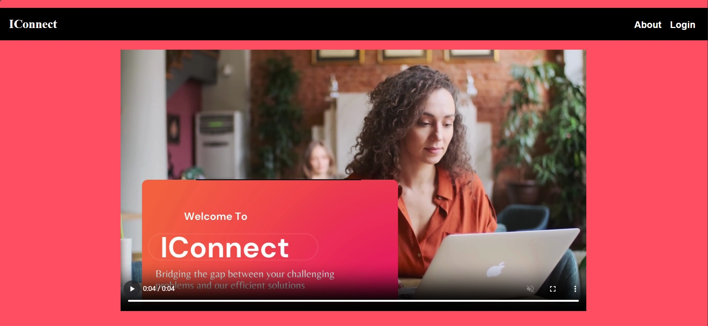            |
| User Page       | 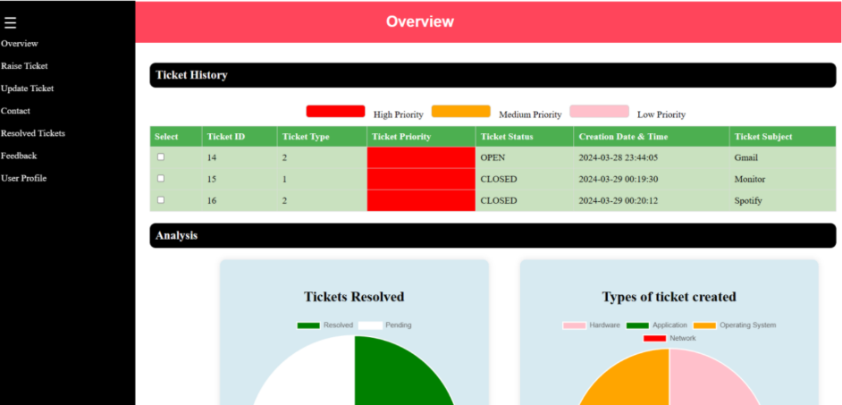            |
| Raise Ticket    | 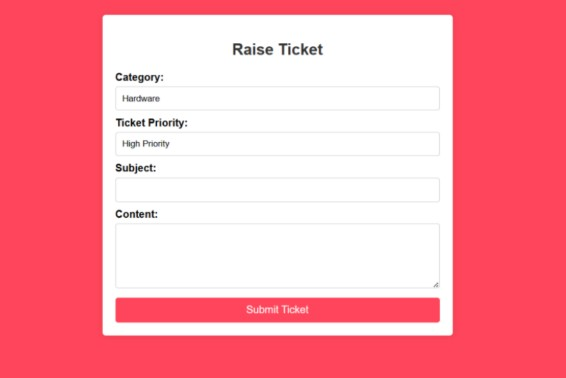      |
| User Mail       | 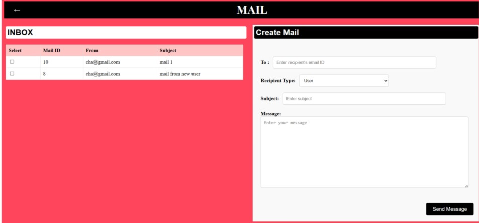            |
| Agent Page      | 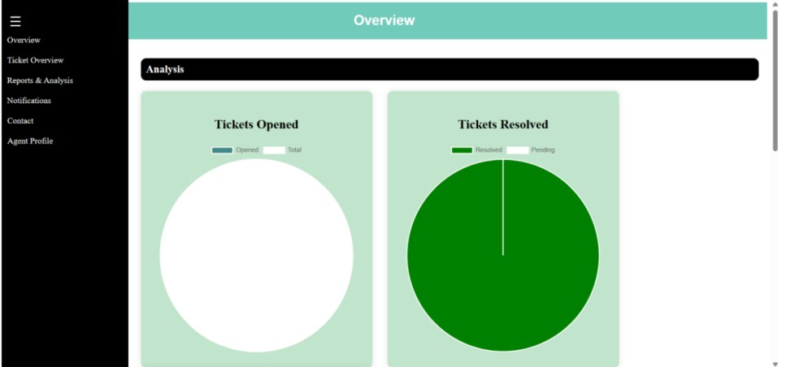          |
| View Ticket     | 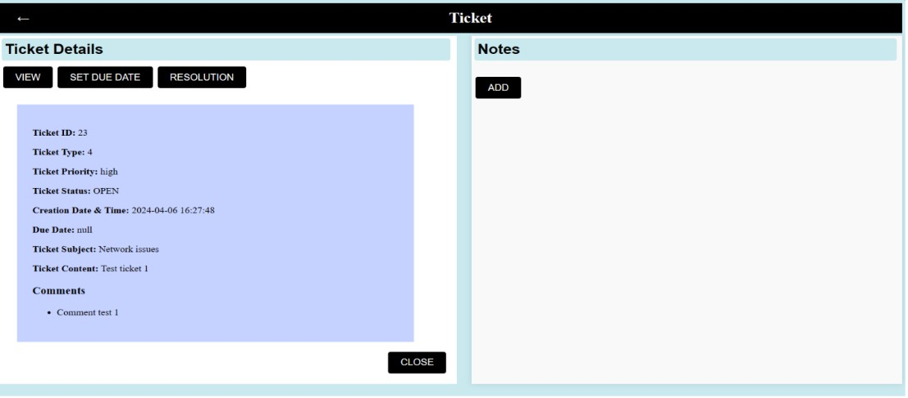        |
| Report          | 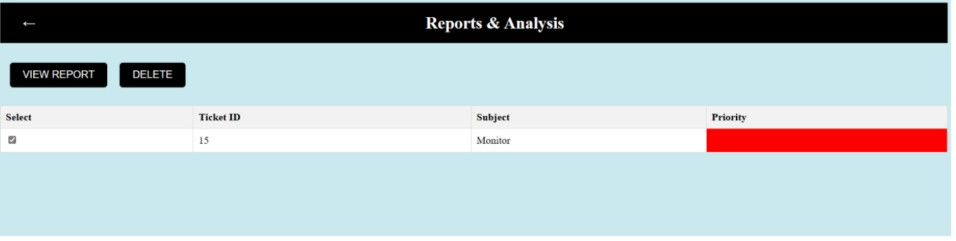                 |
| Admin Page      | 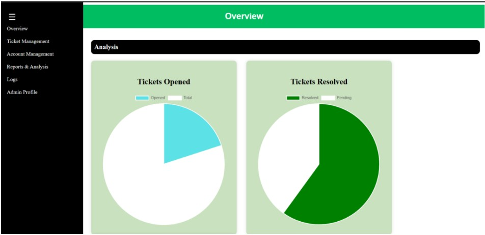          |
| Tickets         | 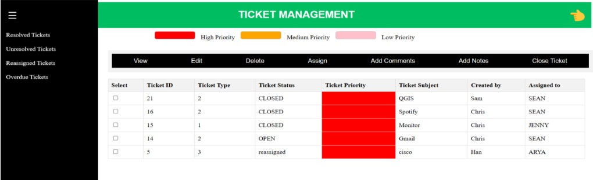          |
| Accounts        | 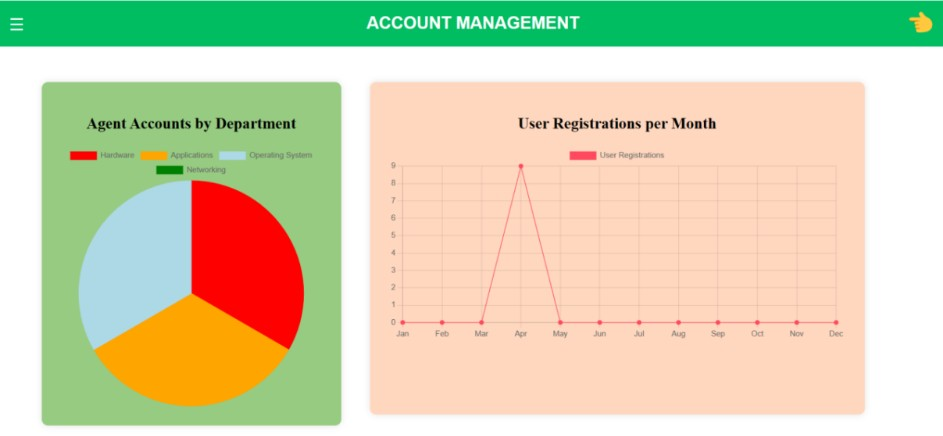            |
| Report          | 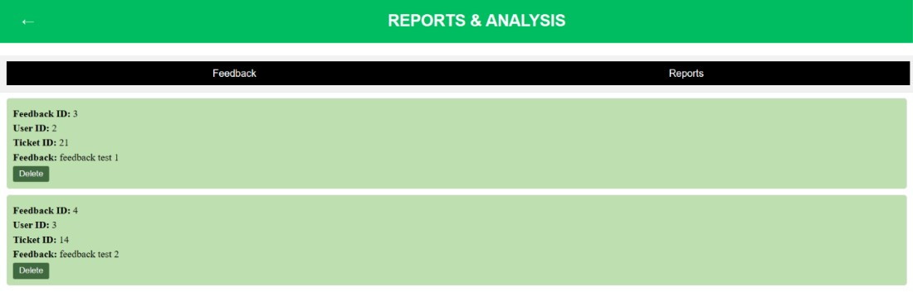          |
| Logs            | 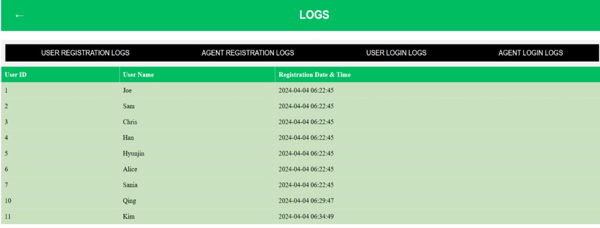              |

## License:-
This project is licensed under the MIT License.

## Developer:-
Sneha Yadav

📧 Email: **snehahyn@gmail.com**

🔗 GitHub: **https://github.com/code4min**
